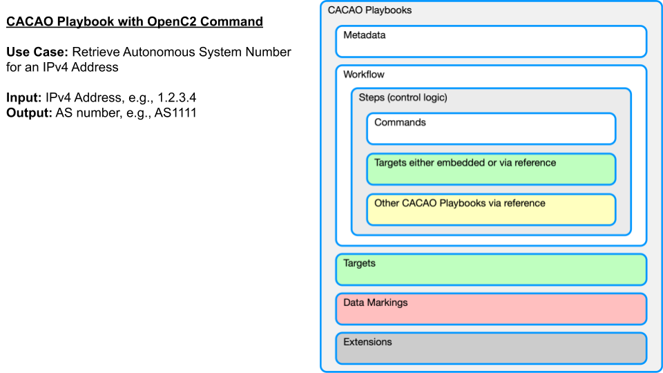
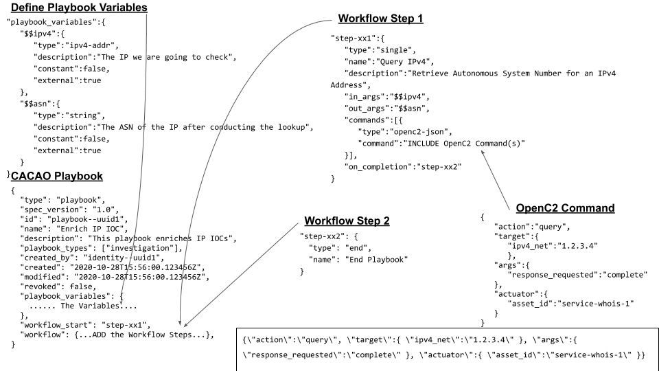

# Second OpenC2 Plugfest - University of Oslo
Online event on October 28, 2020

[Summary of Results](https://github.com/oasis-tcs/openc2-usecases/tree/master/TTD-PlugfestHackathon/Results) from all participants.

## Use Case Demonstrated by Vasileios Mavroeidis (University of Oslo)
Demonstrated how CACAO Security Playbooks can integrate OpenC2 commands. The [CACAO Playbook](https://github.com/Vasileios-Mavroeidis/openc2-plugfest/blob/master/2020-October/cacao_playbook_openc2.json) in JSON serialization format.

In particular, a use case where a CACAO Playbook integrates an OpenC2 command for retrieving the autonomous system number for an IPv4 address.

